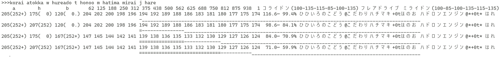

# code_samples
すべてのコードは公開/共有を想定していないため、雑な点が多々あります。

## my_markdown_parser
数式が入ったMarkdownファイルを、mathjaxで数式を表示するHTMLファイルに変換する。

## my_notification
Action Centerから消えてしまうWindowsデスクトップ通知（DiscordとGmail）を再通知して消えないようにする。また、各種ウェブサイトの通知を取得してログを取る。

## pokemon_calculator
私にとって最も使いやすいことを目指した、ポケモン対戦におけるダメージ計算をするコマンドラインプログラム。ローマ字表記で入力し、前方一致で入力内容が一つに定まるとき、それを入力にする。相手の情報を指定しない場合、複数のパターンを同時に出力する。パーティ保存機能等も実装している。

実行例:

